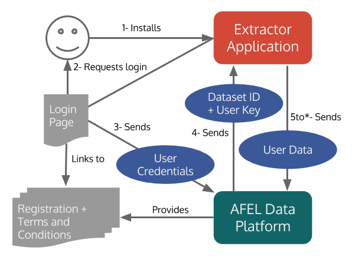

# AFEL Browsing History WebExtension
Contributors: Mathieu d'Aquin (@mdaquin), Alessandro Adamou(@anticitizen79)

The AFEL Browsing History WebExtension is one of the Browsing History Extractors developed in the [AFEL Project](http://afel-project.eu). It is a browser add-on running in the background while you use the browser in the Web, and sends information about your browsing to the [AFEL Data Platform](http://data.afel-project.eu). It will require login onto the AFEL Data Platform, either with an existing account or through registration.

This add-on has been developed as a WebExtension, the preferred format for browser extensions that became a cross-platform standard in 2017.

## Requirements

You can __run__ this WebExtension on any of the following browsers:
- Google Chrome
- Firefox version 50.0 ([released Nov 2016](https://wiki.mozilla.org/RapidRelease/Calendar)) and above
- Opera version 33 and above
- Vivaldi

_Microsoft Edge_ is also picking up support for WebExtensions, however this add-on will only work if and when Microsoft [decides to support](https://docs.microsoft.com/en-us/microsoft-edge/extensions/api-support/extension-api-roadmap) the history API.

If you want to __build__ the extension from source, you will need the [Yarn package manager](https://yarnpkg.com) to install external dependencies.

## Installation 

Whichever installation method you choose, please make sure to read and accept the [Terms and Conditions](http://data.afel-project.eu/catalogue/index.php/terms-browsing/) before downloading and activating this browser extension.

### From extension marketplaces
- Chrome Web Store: https://chrome.google.com/webstore/detail/afel-activity-monitor/llipmmlocnefdomgmljdfgmlnhaphpoi
- Firefox add-ons: https://addons.mozilla.org/en-GB/firefox/addon/afel-activity-monitor/

### From source
To ensure you get the latest development version, you should be able to install it as an unpackaged extension after setting your browser to accept developer-mode extensions.

1. Download or `git clone` this repository into a local directory.
2. Import external dependencies. From the command line:

       $ cd browser-history-webext
       $ yarn install
3. In your Web browser, choose the menu option for managing extensions (_Window &rarr; extensions_ in Chrome; _View &rarr; Show Extensions_ in Opera; _Tools &rarr; Add-ons_ in Firefox)
4. Enable _Developer mode_ for extensions (_Debug Add-on_ in Firefox)
5. Select _Load unpacked extension_ (_Load Temporary Extension_ in Firefox) to select the directory where the extension has been downloaded. Some browsers may require you to select the `manifest.js` file inside, others will just ask you to point to the directory where it resides.

## Usage
The first time the extension is enabled, a new tab should appear in your browser showing a login page to the AFEL data platform. Please [register](http://data.afel-project.eu/catalogue/wp-login.php?action=register) if you don't already have an account. Once logged in, the extension will have obtained all the details needed to updload data about browsing activity on the AFEL Data Platform. A small icon will have also appeared on the right hand side of the browser's address bar, showing that the extension is active. Clicking on this icon will give you a link to the [AFEL User Dashboard](http://data.afel-project.eu/catalogue/index.php/user-dashboard/) where you can monitor your own activity from this and other AFEL extractors.

### Workflow

This extension represents a typical form of user-centric data extractor for the AFEL Data Platform. As such, it is worth detailing the workflow through which this interaction happens. This workflow is described in the diagram below.

where the Extractor application here is the extension and the login page is achieved through a local tab.

The API to provide dataset ID and user key in the platform is part of the [Data Catalogue](https://github.com/afel-project/datahub-catalogue), through the [Data Catalogue Process Plugin](https://github.com/afel-project/data-catalogue-process-wordpress). The actual use data (in this case, browsing activity data), is transferred to the AFEL Data Platfrom through the [Entity Centric API](https://github.com/afel-project/entity-centric-api).

### Getting your own data

A dashboard and mobile application to visualise, explore and even download your own data will be available [on the data platform](http://data.afel-project.eu/catalogue/user-dashboard/).

### Turning off the monitoring

We are adding a button to turn off the monitoring done by the extension. Alternatively, you can either instruct your browser to temporarily disable the extension or use the incognito mode when you don't want your activity to be monitored.

## Licence 
The AFEL Chrome Browsing History Extension us distributed under the [Apache Licence V2](https://www.apache.org/licenses/LICENSE-2.0). Please attribute *[Mathieu d'Aquin](http://mdaquin.net) and [Alessandro Adamou](http://kmi.open.ac.uk/people/member/alessandro-adamou) from [The Open University](http://www.open.ac.uk) through the [AFEL Project](http://afel-project.eu)* when reusing and redistributing this code.
